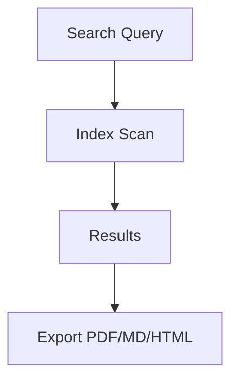

## Overview

Horuse provides powerful tools to streamline your documentation workflow. You organize content into folders, track changes with version history, collaborate seamlessly with teams, and leverage search and export options for efficiency. These features help you maintain high-quality docs at scale.

## Key Features

<Columns cols={2}>
  <Card title="Document Folders" icon="folder" href="#document-organization">
    Organize docs hierarchically for easy navigation.
  </Card>
  <Card title="Version Control" icon="git-branch" href="#version-control">
    Track every change with full history and rollbacks.
  </Card>
  <Card title="Team Collaboration" icon="users" href="#collaboration">
    Real-time editing and permissions for teams.
  </Card>
  <Card title="Search & Export" icon="search" href="#search-export">
    Find content fast and export in multiple formats.
  </Card>
</Columns>

## Document Organization

Use folders to structure your documentation logically. Create nested folders for projects, APIs, or guides.

<Steps>
  <Step title="Create Folder" icon="plus">
    Navigate to your workspace and click the folder icon.
  </Step>
  <Step title="Add Documents" icon="file-text">
    Drag files or use the `+ New Doc` button.
  </Step>
  <Step title="Rearrange" icon="move">
    Drag folders to reorder or nest them.
  </Step>
</Steps>

<Callout kind="tip">
  Limit nesting to three levels for optimal navigation.
</Callout>

## Version Control and History

Horuse tracks every edit automatically. View diffs, restore versions, or compare changes.

<Tabs>
  <Tab title="View History" icon="clock">
    Right-click a document and select `View History`.
    
    Restore any version with one click.
  </Tab>
  <Tab title="API Access" icon="api">
    Fetch history programmatically.
    
````javascript
const response = await fetch('https://api.example.com/docs/{docId}/history', {
  headers: { Authorization: `Bearer ${YOUR_TOKEN}` }
});
const history = await response.json();
````
  </Tab>
</Tabs>

## Collaboration Tools

Invite team members, set permissions, and edit in real-time. Resolve conflicts automatically.

<CodeGroup tabs="Invite,Permissions">
````javascript
// Invite user
await fetch('https://api.example.com/workspaces/{workspaceId}/invites', {
  method: 'POST',
  body: JSON.stringify({ email: 'team@company.com', role: 'editor' })
});
````
````javascript
// Set permissions
await fetch('https://api.example.com/docs/{docId}/permissions', {
  method: 'PATCH',
  body: JSON.stringify({ userId: '123', access: 'read' })
});
````
</CodeGroup>

<Expandable title="Advanced Permissions" default-open="false">
  Use role-based access: `admin`, `editor`, `viewer`.
</Expandable>

## Search and Export

Search across all docs with full-text indexing. Export to PDF, Markdown, or HTML.



| Feature | Description | Formats |
|---------|-------------|---------|
| Global Search | Instant results `<100ms` | - |
| Filters | By folder, date, author | - |
| Export | Bulk or single doc | PDF, MD, HTML |

<Callout kind="success">
  Exports include version history for audits.
</Callout>